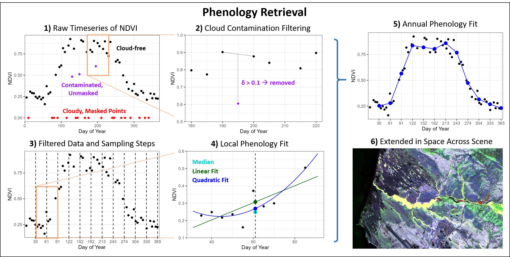

# CORVUS - COntinuous Regression of Variables Uncovering Seasonality

This library provides tools for generating temporally-resampled satellite data. The library is available for use under the GNU General Public License (Version 3). If you use this in academic work, please cite this article:

https://doi.org/10.1016/j.rse.2024.114056

As described above, you can use the fit_phenology function in the phenology_extraction module to resample any temporally-continuous data variable in an ImageCollection into an evenly-spaced time sampling basis (e.g. monthly, weekly, etc.). 

The cloud_temporal_filter in the cloud_temporal_filter module can be used to identify and remove clouds based on their temporal signature (contrast in NDVI vs. preceeding and following scenes at the same point). 

Check back regularly, because this software is still under active development. Near-term anticipated changes include:

1. Expansion to include Sentinel-2 and MODIS
2. Computational improvements to cloud filter
3. Uncertainty estimates based on sample density in window around target date

Note that a JavaScript version of the library also exists here for use in the Earth Engine Code Editor (browser interface):

https://earthengine.googlesource.com/users/conormcmahon/CORVUS/+/refs/heads/master

Fig. 1. Overall framework for phenology retrieval. In sub-plots 1 and 3, orange windows indicate zoomed-in extents for sub-plots 2 and 4. 1) Surface reflectance satellite imagery is collected and converted to a vegetation index (here the Normalized Difference Vegetation Index, NDVI); 2) Temporal filters are applied to remove pixels contaminated by clouds and other atmospheric effects; 3) Sampling steps are fixed at regular intervals in time (here, monthly); 4) Phenology values are fit using a quadratic, linear, or median value within time windows around each target timestamp; 5) Values are fit at each timestamp to produce a regularly-spaced seasonal NDVI curve; 6) The process is repeated for each pixel to produce spatial maps of seasonality.
